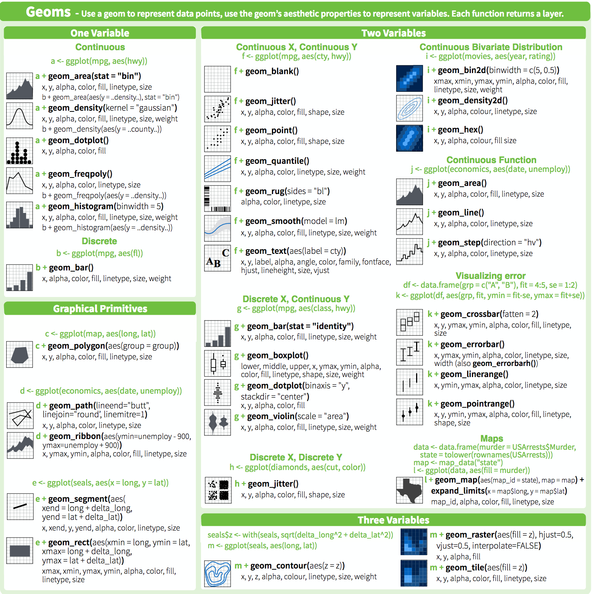

# data-visualization-R

Variables as dimensions

First and second dimensions
Position (x, y)


# measurements over time
line (a series of measurements that are all related/connected, no more than 1 y value per x value)
scatter (dots on continuous x and y)


Third dimensions
shape
fill 
outline style (solid, dashed, dotted, etc)
outline color

fill color (hue, transparency)

Position (x, y)
Facet (separate plots)


# line plot
# multiple lines
# multiple lines with multiple facets

# Distributions

# 


# Distributions (MOST to LEAST data shown)
* beeswarm
* jitter plot
* histogram
* freqpoly or violin plot
* boxplot

# Level up your plot
* Themes https://yutannihilation.github.io/allYourFigureAreBelongToUs/ggthemes/
* viridis color scales 
* Renaming things
    * Title, axes
    * Legend
* ordering factors
* renaming facets with labeller
* using scientific notation in labels
* exporting svg with ggsave() (requires svglite)
* combining plots with cowplot

# Heatmaps


# Example plotting project: Measurements over time
* Survivorship curve
* Survivorship curve, multiple treatments
* Survivorship curve, multiple treatments + replicates
* Survivorship curve, multiple treatments + replicates + cell line
* Survivorship curve, multiple treatments + replicates + cell line + mutation
* add a regression line
* growth curve, same idea


## 
## Faceting
+ facet_grid(x~y)

## Heatmap
Many groups, defined as combination of two factors (x and y), plus a third dimension (typically numeric value, NOT a distribution)

```R
library(data.table)
library(ggplot2)

dat <- data.table(
    'A'=sample(LETTERS[1:8], size=100, replace=T),
    'B'=sample(LETTERS[10:14], size=100, replace=T),
    'C'=runif(100),
    'D'=runif(100)
)

ggplot(dat, aes(x=A, y=B, fill=C)) + geom_tile()
```

# Themes

# Flip axes


Course Title: Data Visualization with R and ggplot

Course Description:
This course provides an in-depth exploration of data visualization techniques using R and ggplot. Students will learn how to create visually appealing and informative plots for data analysis and communication. The course will cover the fundamental principles of data visualization, as well as practical skills in using the ggplot2 package to generate a wide range of visualizations. Through hands-on exercises and projects, students will gain proficiency in creating static and interactive plots, customizing visual elements, and effectively communicating insights through visual representations.

Course Duration: 10 weeks

Learning Objectives:
- Understand the principles and best practices of data visualization
- Gain proficiency in using the ggplot2 package for data visualization in R
- Create a variety of static and interactive plots using ggplot
- Customize visual elements, including colors, fonts, and annotations
- Apply advanced techniques for visualizing complex data, such as faceting and layering
- Employ effective storytelling techniques in data visualization
- Develop skills in critiquing and improving data visualizations

Prerequisites:
- Basic knowledge of R programming and data manipulation


Day 1

Part 1: Introduction to Data Visualization and ggplot2
- Principles of data visualization
- Introduction to ggplot2 package


`geom_jitter` is like `geom_point` but adds a small amount of noise to the data, so it's easier to see data density if many points are overlapping.

These geoms are some of the most commonly used in ggplot and provide a versatile set of tools for visualizing different types of data. Remember that there are many more geoms available in ggplot, and you can explore the package documentation to discover additional geoms that suit your specific visualization needs.


dat <- fread('cell_survival_1.tsv')
setnames(dat, 'Time (hours)', 'time')
dat[, survival := `Survival Rate`/100]

```R
ggplot +
geoms +
scales (optional) +
themes (optional)
```

Part 2: Data Preparation for plotting
- Data cleaning and preparation for visualization
- Formatting data in long format

Part 3: Geom overview
In ggplot, geoms (short for geometric objects) are used to represent the visual elements within a layer of a plot. Of note are:

1. `geom_point`: for scatter plots, representing data points as individual dots.
2. `geom_line`: for line plots, connecting data points with straight lines.
3. `geom_bar`: for bar plots, representing data as rectangular bars of varying heights.
    `geom_col` = `geom_bar(stat='identity')
4. `geom_histogram`: for histograms, displaying the distribution of a continuous variable as bars.
5. `geom_boxplot` and `geom_violin`: for multiple distributions. Box plots show quartiles, violins show the whole distribution's smoothed shape. `geom_beeswarm` is like a violin plot that shows the data points themselves.
6. `geom_area`: for area plots, filling the area between a line or curve and an axis.
7. `geom_text`: for adding text labels to a plot, labeling specific data points or adding annotations.
8. `geom_tile`: for creating heatmaps, displaying data values as colored tiles in a grid.
9. `geom_density`: for kernel density plots, visualizing the estimated probability density function of a variable.
10. `geom_smooth`: for adding a smooth line or curve to a scatter plot, indicating a trend or relationship.

Part 4: Customizable parts
- Working with colors, shapes, and sizes
- Adding labels and annotations
- Adjusting axes and scales

Part 4: Single Variable Visualization
- Histograms and density plots
- Bar plots and pie charts
- Box plots and violin plots

On Your Own: Plotting cell growth data
- bar plot of average final values
- box, violin, bee swarm of final values
- line plot of first replicates
- geom_smooth with binomial 
Day 2

Part 5: Multivariate Visualization
- Scatter plots
- Line plots and area plots
- Heatmaps and correlation plots

Part X: Faceting
Advanced: Layering multiple geoms
Advanced: Scales
Part X: Three variables
    Heat maps

Customization:
Part X: Themes
Part X: 


- Techniques for improving visualizations


```R
ggplot(o, aes(x=time, y=Absorbance, color=Genotype, linetype=Drug)) +
  geom_smooth(method = "glm", 
              method.args = list(family = "binomial"), 
              se = FALSE)

```

# 96 well plate of absorbance over time
# col 1-12
# row ABCDEFGH

```R
foreach(col=1:12, row=LETTERS[1:8], .combine='rbind') %do% {
    foreach(minutes=seq(0,1440,60), .combine='rbind') %do% {
        data.table(
    }
}


g*genotype + d*drug + i*interaction

Genotype        g
WT              1.0
MUTA            0.9
MUTB            0.8

Drug            d
NODRUG          1
DrugA           0.6
DrugB           0.75

Interaction     i
WT-No           1
WT-A            -0.2
WT-B            0.2

MUTA-No         1
MUTA-A          0.4
MUTA-B          0.6

MUTB-No         -0.4
MUTB-A          0.25
MUTB-B          -0.25

o <- foreach(replicate=1:8, .combine='rbind') %do% {
dat <- CJ(
    'Genotype'=c('WT','Mut_A','Mut_B'),
    'Drug'=c('None','Drug_X','Drug_Z')
)
dat <- dat[rev(1:9)]

dat[, 'mp' := 24]
dat[, 'k' := 0.2]
dat[, 'curve_max' := 3]
dat[Genotype=='WT', k := k - (k*rnorm(1)/5)]
dat[Genotype=='WT', mp := mp + (mp*rnorm(1)/50)]
dat[Genotype=='Mut_A', mp := mp + 15]
dat[Genotype=='Mut_A', mp := mp + (mp*rnorm(1)/50)]
dat[Genotype=='Mut_A', k := k - 0.05]
dat[Genotype=='Mut_A', k := k - (k*rnorm(1)/5)]
dat[Genotype=='Mut_B', mp := mp + 33]
dat[Genotype=='Mut_B', mp := mp + (mp*rnorm(1)/50)]
dat[Genotype=='Mut_B', k := k - -.08]
dat[Genotype=='Mut_B', k := k - (k*rnorm(1)/5)]
dat[Drug=='None', curve_max := curve_max * 1]
dat[Drug=='None', curve_max := curve_max + (curve_max*rnorm(1)/20)]
dat[Drug=='Drug_X', curve_max := curve_max * 0.8]
dat[Drug=='Drug_X', curve_max := curve_max + (curve_max*rnorm(1)/20)]
dat[Drug=='Drug_Z', curve_max := curve_max * 0.2]
dat[Drug=='Drug_Z', curve_max := curve_max + (curve_max*rnorm(1)/20)]

dat <- foreach(time=1:72, .combine='rbind') %do% {
    tmp <- copy(dat)
    tmp[, 'time' := time]
    return(tmp)
}

dat[, 'Absorbance' := curve_max / (1 + exp(-1*k*(time-mp)))]

dat[, noise := rnorm(nrow(dat))]
dat[, 'Absorbance' := Absorbance + (noise/50)]
dat[, 'Replicate' := replicate]
return(dat[time <= 36])
}

o[, c('mp','k','curve_max','noise') := NULL]
setkey(o, Genotype, Drug, Replicate, time)

o[Absorbance < 0, Absorbance := 0]
max_absorbance <- max(o$Absorbance)
o[,Absorbance := Absorbance/max_absorbance]

fwrite(o, file='cellgrowth_all.tsv', sep='\t')

#ggplot(o, aes(x=time, y=Absorbance, linetype=Genotype, color=Drug)) + geom_point()
ggplot(o, aes(x=time, y=Absorbance, color=Genotype)) + geom_line() + facet_grid(Replicate~Drug)

ggplot(o, aes(x=Drug, y=Absorbance)) + geom_boxplot() + facet_grid(.~Genotype)


dat[Genotype=='WT', mp := 1]
dat[Genotype=='WT', mp := 1]
dat[Genotype=='Mut_A', mp := -0.05]
dat[Genotype=='Mut_A', mp := -0.05]
dat[Genotype=='Mut_B', mp := -0.15]
dat[Genotype=='Mut_B', mp := -0.15]

dat[Drug=='None', d := 1]
dat[Drug=='Drug_X', d := -0.15]
dat[Drug=='Drug_Z', d := -0.1]


curve_max <- 3


dat[, k := 1 + g + d + 2*interaction]


```

AB_MUTA_Nodrug
CD_MUTA_DrugA
EF_MUTA_DrugB
GH_MUTA_DrugC


AB_MUTB_Nodrug
CD_MUTB_DrugA
EF_MUTB_DrugB
GH_MUTB_DrugC